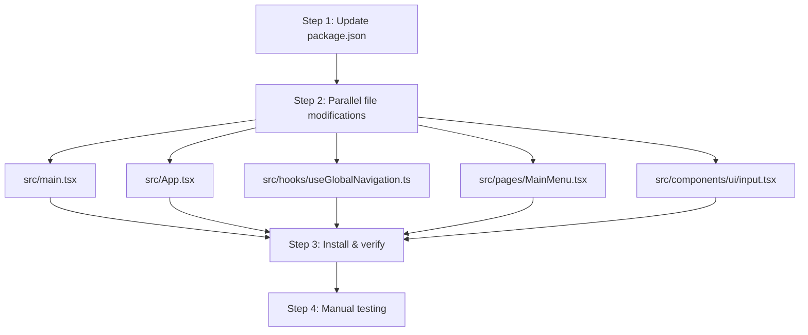

# React 19 Migration Strategy

Migration plan for upgrading from **React 16.14 + React Router v5** to **React 19 + React Router v7**.

## Current State

| Dependency              | Current Version | Target Version |
| ----------------------- | --------------- | -------------- |
| `react`                 | ^16.14.0        | ^19.1.0        |
| `react-dom`             | ^16.14.0        | ^19.1.0        |
| `react-router-dom`      | ^5.3.4          | ^7.0.0         |
| `@types/react`          | ^16.14.0        | ^19.1.0        |
| `@types/react-dom`      | ^16.9.0         | ^19.1.0        |
| `@types/react-router-dom` | ^5.3.3       | *(remove — types bundled in v7)* |

### Favorable Conditions

- All components are functional (no class components)
- No legacy lifecycle methods, `defaultProps`, or `propTypes`
- All third-party dependencies already support React 19

---

## Breaking Changes Inventory

| Breaking Change | React Version | Files Affected |
| --------------- | ------------- | -------------- |
| `ReactDOM.render()` removed | 18+ | `src/main.tsx` |
| `React.forwardRef` deprecated | 19 | `src/components/ui/input.tsx` |
| `Switch` removed | Router v6+ | `src/App.tsx` |
| `Route component` prop removed | Router v6+ | `src/App.tsx` |
| `exact` prop removed | Router v6+ | `src/App.tsx` |
| `useHistory` removed | Router v6+ | `src/hooks/useGlobalNavigation.ts`, `src/pages/MainMenu.tsx` |

---

## Execution Plan

All dependency changes are applied in a single step, then all file modifications are performed **in parallel** since none depend on each other.



---

### Step 1 — Update `package.json`

Apply all dependency version changes in a single edit:

**`dependencies`:**

```diff
- "@types/react-router-dom": "^5.3.3",
- "react": "^16.14.0",
- "react-dom": "^16.14.0",
- "react-router-dom": "^5.3.4",
+ "react": "^19.1.0",
+ "react-dom": "^19.1.0",
+ "react-router-dom": "^7.0.0",
```

> Remove `@types/react-router-dom` entirely — types are bundled in React Router v7.

**`devDependencies`:**

```diff
- "@types/react": "^16.14.0",
- "@types/react-dom": "^16.9.0",
+ "@types/react": "^19.1.0",
+ "@types/react-dom": "^19.1.0",
```

---

### Step 2 — Parallel File Modifications

The following five files are **independent** of each other and can all be modified simultaneously.

#### 2A. `src/main.tsx` — `ReactDOM.render` → `createRoot`

**Reason:** `ReactDOM.render` was removed in React 18. The new entry point API is `createRoot` from `react-dom/client`.

```diff
  import React from 'react'
- import ReactDOM from 'react-dom'
+ import { createRoot } from 'react-dom/client'
  import App from './App.tsx'
  import './index.css'

- ReactDOM.render(
-   <React.StrictMode>
-     <App />
-   </React.StrictMode>,
-   document.getElementById('root')
- )
+ createRoot(document.getElementById('root')!).render(
+   <React.StrictMode>
+     <App />
+   </React.StrictMode>
+ )
```

#### 2B. `src/App.tsx` — React Router v5 → v7

**Reason:** `Switch` is replaced by `Routes`. The `component` prop on `<Route>` is replaced by `element` (which takes JSX). The `exact` prop is no longer needed — v6+ routes match exactly by default.

```diff
- import { BrowserRouter as Router, Switch, Route } from 'react-router-dom';
+ import { BrowserRouter as Router, Routes, Route } from 'react-router-dom';
  import { MainMenu, PortfolioInquiry, TransactionHistory } from './pages';
  import { ROUTES } from './types/routes';
  import { useGlobalNavigation } from './hooks/useGlobalNavigation';

  function AppContent() {
    useGlobalNavigation();

    return (
-     <Switch>
-       <Route exact path={ROUTES.MAIN_MENU} component={MainMenu} />
-       <Route path={ROUTES.PORTFOLIO_INQUIRY} component={PortfolioInquiry} />
-       <Route path={ROUTES.TRANSACTION_HISTORY} component={TransactionHistory} />
-     </Switch>
+     <Routes>
+       <Route path={ROUTES.MAIN_MENU} element={<MainMenu />} />
+       <Route path={ROUTES.PORTFOLIO_INQUIRY} element={<PortfolioInquiry />} />
+       <Route path={ROUTES.TRANSACTION_HISTORY} element={<TransactionHistory />} />
+     </Routes>
    );
  }
```

#### 2C. `src/hooks/useGlobalNavigation.ts` — `useHistory` → `useNavigate`

**Reason:** `useHistory` was removed in React Router v6. The replacement is `useNavigate`, which returns a function directly instead of a history object.

```diff
  import { useEffect } from 'react';
- import { useHistory, useLocation } from 'react-router-dom';
+ import { useNavigate, useLocation } from 'react-router-dom';
  import { ROUTES } from '../types/routes';

  export function useGlobalNavigation() {
-   const history = useHistory();
+   const navigate = useNavigate();
    const location = useLocation();

    useEffect(() => {
      const handleGlobalKeyDown = (event: KeyboardEvent) => {
        if (event.key === 'Escape') {
          // ... existing guard clauses unchanged ...

          event.preventDefault();
-         history.push(ROUTES.MAIN_MENU);
+         navigate(ROUTES.MAIN_MENU);
        }
      };

      document.addEventListener('keydown', handleGlobalKeyDown);

      return () => {
        document.removeEventListener('keydown', handleGlobalKeyDown);
      };
-   }, [history, location.pathname]);
+   }, [navigate, location.pathname]);
  }
```

#### 2D. `src/pages/MainMenu.tsx` — `useHistory` → `useNavigate`

**Reason:** Same as 2C — `useHistory` is removed in React Router v6+.

```diff
  import { useState } from 'react';
- import { useHistory } from 'react-router-dom';
+ import { useNavigate } from 'react-router-dom';
  import { MENU_OPTIONS, MenuState } from '../types/menu';
  import { useKeyboardNavigation } from '../hooks/useKeyboardNavigation';
  import MenuOption from '../components/MenuOption';
  import { Container, PageHeader } from '../components';

  export default function MainMenu() {
-   const history = useHistory();
+   const navigate = useNavigate();
    const [menuState, setMenuState] = useState<MenuState>({
      selectedOption: null,
      isKeyboardNavigation: false
    });

    const handleOptionActivate = (index: number) => {
      const option = MENU_OPTIONS[index];
      if (!option) return;

      setMenuState(prev => ({
        ...prev,
        selectedOption: option.id,
        isKeyboardNavigation: true
      }));

      if (option.route) {
-       setTimeout(() => history.push(option.route!), 150);
+       setTimeout(() => navigate(option.route!), 150);
      }
    };
```

#### 2E. `src/components/ui/input.tsx` — Remove `forwardRef`

**Reason:** In React 19, `ref` is a regular prop. `forwardRef` is deprecated and no longer needed.

```diff
  import * as React from "react"
  import { cn } from "@/lib/utils"

- const Input = React.forwardRef<HTMLInputElement, React.ComponentProps<"input">>(
-   ({ className, type, ...props }, ref) => {
-     return (
-       <input
-         type={type}
-         data-slot="input"
-         className={cn(
-           "file:text-foreground placeholder:text-muted-foreground selection:bg-primary selection:text-primary-foreground dark:bg-input/30 border-input flex h-9 w-full min-w-0 rounded-md border bg-transparent px-3 py-1 text-base shadow-xs transition-[color,box-shadow] outline-none file:inline-flex file:h-7 file:border-0 file:bg-transparent file:text-sm file:font-medium disabled:pointer-events-none disabled:cursor-not-allowed disabled:opacity-50 md:text-sm",
-           "focus-visible:border-ring focus-visible:ring-ring/50 focus-visible:ring-[3px]",
-           "aria-invalid:ring-destructive/20 dark:aria-invalid:ring-destructive/40 aria-invalid:border-destructive",
-           className
-         )}
-         ref={ref}
-         {...props}
-       />
-     )
-   }
- )
- Input.displayName = "Input"
+ function Input({ className, type, ref, ...props }: React.ComponentProps<"input">) {
+   return (
+     <input
+       type={type}
+       data-slot="input"
+       className={cn(
+         "file:text-foreground placeholder:text-muted-foreground selection:bg-primary selection:text-primary-foreground dark:bg-input/30 border-input flex h-9 w-full min-w-0 rounded-md border bg-transparent px-3 py-1 text-base shadow-xs transition-[color,box-shadow] outline-none file:inline-flex file:h-7 file:border-0 file:bg-transparent file:text-sm file:font-medium disabled:pointer-events-none disabled:cursor-not-allowed disabled:opacity-50 md:text-sm",
+         "focus-visible:border-ring focus-visible:ring-ring/50 focus-visible:ring-[3px]",
+         "aria-invalid:ring-destructive/20 dark:aria-invalid:ring-destructive/40 aria-invalid:border-destructive",
+         className
+       )}
+       ref={ref}
+       {...props}
+     />
+   )
+ }
+ Input.displayName = "Input"

  export { Input }
```

---

### Step 3 — Install & Verify

```bash
npm install
npx tsc --noEmit
npm run build
```

Fix any type errors surfaced by the compiler.

---

### Step 4 — Manual Testing

| Test Case | Steps | Expected Result |
| --------- | ----- | --------------- |
| App loads | Navigate to `/` | Main Menu renders with menu options |
| Keyboard navigation | Press `↑` / `↓` arrow keys on Main Menu | Focus moves between menu options |
| Number key shortcuts | Press `1` or `2` on Main Menu | Corresponding menu option activates |
| Route navigation | Click a menu option | Navigates to the correct page |
| Escape key | Press `Esc` on a sub-page | Returns to Main Menu |
| Escape key (Main Menu) | Press `Esc` on Main Menu | No navigation occurs |
| Portfolio search | Enter account number, submit | Portfolio data loads and displays |
| Transaction history | Navigate from portfolio to transactions | Transaction page loads with account param |
| Back navigation | Click "← Back to Main Menu" links | Returns to Main Menu |
| Input focus | Click into account input field | Input receives focus, `ref` works correctly |

---

### Files Changed Summary

| File | Change | Parallel Group |
| ---- | ------ | -------------- |
| `package.json` | Dependency version bumps, remove `@types/react-router-dom` | Step 1 (prerequisite) |
| `src/main.tsx` | `ReactDOM.render` → `createRoot` | Step 2A |
| `src/App.tsx` | `Switch`/`Route component` → `Routes`/`Route element` | Step 2B |
| `src/hooks/useGlobalNavigation.ts` | `useHistory` → `useNavigate` | Step 2C |
| `src/pages/MainMenu.tsx` | `useHistory` → `useNavigate` | Step 2D |
| `src/components/ui/input.tsx` | Remove `forwardRef` wrapper | Step 2E |

### Files Requiring No Changes

| File | Reason |
| ---- | ------ |
| `src/pages/TransactionHistory.tsx` | Uses `Link` and `useLocation` — API unchanged in Router v7 |
| `src/pages/PortfolioInquiry.tsx` | Uses `Link` — API unchanged in Router v7 |
| `tsconfig.json` | Already configured with `"jsx": "react-jsx"` |
| `vite.config.ts` | `@vitejs/plugin-react` ^5 supports React 19 |

### Third-Party Compatibility

| Library | Version | React 19 Support |
| ------- | ------- | ----------------- |
| `@radix-ui/react-slot` | ^1.2.3 | Yes |
| `react-hook-form` | ^7.62.0 | Yes (v7.54+) |
| `@hookform/resolvers` | ^5.2.1 | Yes |
| `lucide-react` | ^0.541.0 | Yes |
| `class-variance-authority` | ^0.7.1 | Yes |
| `zod` | ^4.1.1 | No React dependency |
| `lodash` | 4.17.15 | No React dependency |
